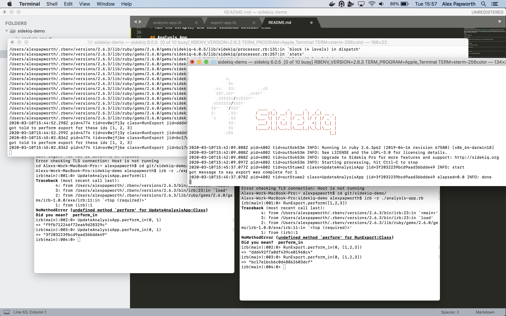

# Sidekiq Two-Way Communcation Demo

A small sidekiq demo created for [OpenCorporates](https://github.com/openc) to test communication between two internal apps.

Note that we can use one Redis URL/queue, but send multiple classes on it. Both apps have both these classes, but only one of them has the `perform` method for each class. It is through this facility that we "place" messages on the queue, and have them removed and performed by the other app.

# Setup

Install the Sidekiq gem.

```bash
gem install sidekiq
```

Make sure you have Redis running, either locally, or on some virtual platform like Docker.

```bash
brew install redis
```

# Run the Sidekiq workers

Do this in two different terminal windows.

```bash
sidekiq -r ./analysis-app.rb
```

and

```bash
sidekiq -r ./export-app.rb
```

# Run the scripts, and send commands between them

## Analysis App

```bash
irb -r ./analysis-app.rb
```

Then try:

```ruby
RunExport.perform_in(0, [1,2,3]) 
```

## Export App

```bash
irb -r ./export-app.rb
```

Then try:

```ruby
UpdateAnalysisApp.perform_in(0, 1)
```

You should see a message appear of the opposite app's sidekiq queue!


